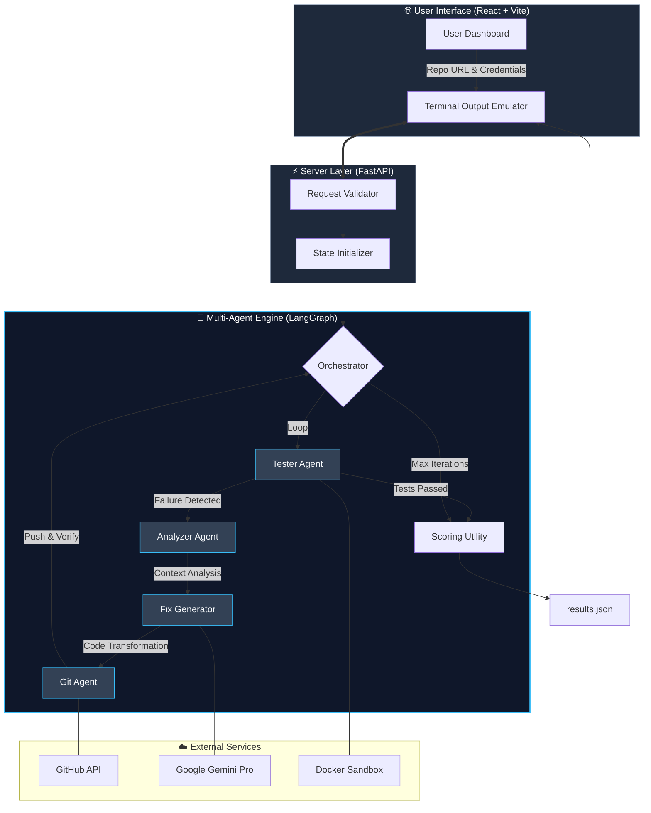

📌 Project Title

**Devion AI – Autonomous Code Review & Self-Healing System**
A multi-agent system built with LangGraph and FastAPI that autonomously clones a repository, runs tests, analyzes failures, and pushes fixes.

---

🌐 Deployment URL

- **Frontend:** https://devion-ai.vercel.app/
- **Backend API:** https://devion-ai.onrender.com

---

🎥 LinkedIn Video URL

🔗 https://linkedin.com/your-demo-video-link

---

## 🏗 Architecture Diagram

Devion AI utilizes a sophisticated agentic workflow powered by **LangGraph**. The system is divided into three primary layers: the Interactive UI, the FastAPI Bridge, and the Multi-Agent Reasoning Engine.



---

## 💻 Tech Stack

- **Frontend:** React 18, Vite, Tailwind CSS, Shadcn/UI, Framer Motion, Lucide Icons
- **Backend:** Python 3.10+, FastAPI, LangGraph, Pydantic
- **AI Engine:** Google Gemini AI (for reasoning and autonomous bug fixing)
- **Environment:** Docker (sandboxed test execution)
- **Source Control:** GitHub API / OAuth

---

## 🐞 Supported Bug Types

Our agent correctly interprets and fixes the following categories of issues according to the exact test case requirements:

- **LOGIC:** Replaces incorrect conditional flows and mathematical/logic bugs
- **SYNTAX:** Resolves syntax and compilation-level errors
- **INDENTATION:** Fixes Python-specific formatting/tab errors
- **IMPORT:** Properly removes unused imports or resolves missing dependencies
- **TYPE_ERROR:** Handles dynamic type mismatches
- **LINTING:** Corrects code quality issues detected by Ruff and Pytest

---

## 🚀 Installation Instructions

### Prerequisites

- Python 3.10+
- Node.js (v18+) & npm/bun
- Docker (must be running on your machine for the sandbox)

### 1. Backend Installation

```bash
cd backend
python -m venv venv

# Windows
venv\Scripts\activate
# Mac/Linux
source venv/bin/activate

pip install -r requirements.txt
```

### 2. Frontend Installation

```bash
cd frontend
npm install
```

---

## ⚙️ Environment Setup

Create a `.env` file in the **`backend/`** directory with the following variables:

```env
GEMINI_API_KEY=your_gemini_api_key
GITHUB_CLIENT_ID=your_github_client_id
GITHUB_CLIENT_SECRET=your_github_client_secret
GITHUB_REDIRECT_URI=https://your-backend-url.com/auth/callback
FRONTEND_URL=https://your-frontend-url.com
```

_(Ensure all OAuth configurations are appropriately mapped to your frontend redirect)._

---

## 💡 Usage Examples

### Starting the Applications

1. **Launch Backend:**
   ```bash
   cd backend
   uvicorn app.main:app --host 0.0.0.0 --port 8000 --reload
   ```
2. **Launch Frontend:**
   ```bash
   cd frontend
   npm run dev
   ```

### Executing the Agent

1. Open the React Dashboard (e.g. `http://localhost:8080` or your deployed URL).
2. Authorize via GitHub using the **"Connect via GitHub"** button.
3. Provide the **GitHub Repository URL** containing your buggy code.
4. Input your **Team Name** and **Leader Name** _(e.g. "RIFT ORGANISERS" and "Saiyam Kumar")_.
5. Click **"Execute AI Fix"**.
6. The agent will auto-clone, test, generate fixes, and push to the new exact branch: `TEAM_NAME_LEADER_NAME_AI_Fix`.
7. Once finished, view the generated `results.json` run summary and timeline iterations on the Dashboard.

---

## 👥 Team Members

- **Pankaj Sagvekar**
- **Gauri Joshi**
- **Shivani Ghulane**
- **Rohit Gholap**

---

© 2026 Devion AI - Built for RIFT 2026 Hackathon.
